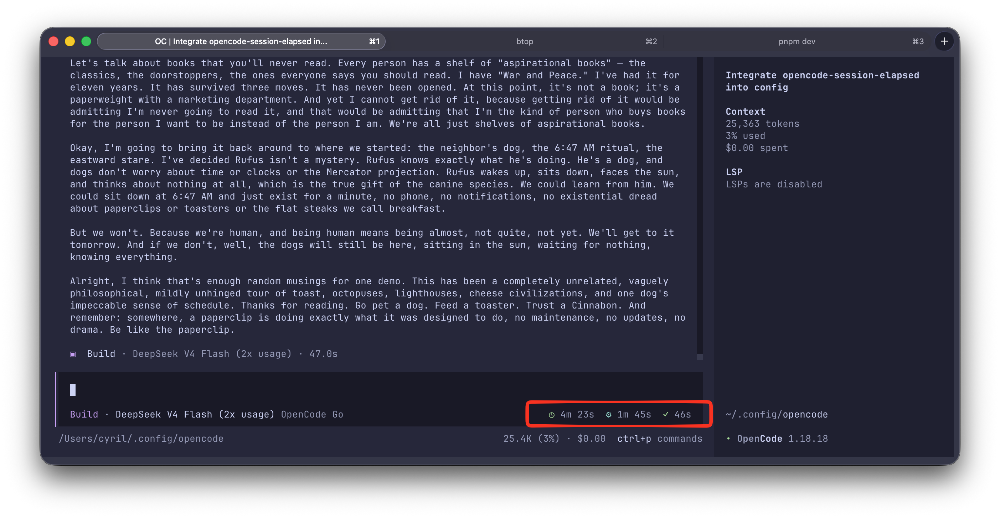

# opencode-session-elapsed

A [OpenCode](https://opencode.ai) TUI plugin that shows live timers in the prompt line:

- **◷ Session elapsed**: how long the current session has been open
- **⚙ Work time**: total time the assistant has been generating (cumulative across the session)
- **⚡ Response time**: time for the current/last response (live while generating, then finalized)

```
  ◷ 2h 3m   ⚙ 1h 12m   ✓ 45s
```



All timers are optional, configurable, and safe to keep on: they disappear automatically when there is nothing to show.

## Requirements

- OpenCode **≥ 1.18.0** (TUI mode)
- macOS / Linux / Windows

## Install

### From npm

Add the plugin to the TUI config in `~/.config/opencode/tui.json`:

```json
{
  "$schema": "https://opencode.ai/tui.json",
  "plugin": ["opencode-session-elapsed"]
}
```

Restart OpenCode. Done: you'll see the timers in the prompt line.

### From source

Clone the repo and reference the plugin file directly:

```bash
git clone https://github.com/siriscmv/opencode-session-elapsed.git
```

```json
{
  "$schema": "https://opencode.ai/tui.json",
  "plugin": ["file:///path/to/opencode-session-elapsed/src/index.tsx"]
}
```

Restart OpenCode. Done: you'll see the timers in the prompt line.

## Configure

Pass options as a tuple entry. All options are optional; defaults are shown below.

```json
{
  "plugin": [
    [
      "opencode-session-elapsed",
      {
        "timers": { "session": true, "work": true, "response": true },
        "format": "compact",
        "icons": true,
        "slot": "session_prompt_right",
        "order": 200,
        "refreshMs": 1000,
        "colors": {
          "session": "#22c55e",
          "work": "#3b82f6",
          "response": "#f59e0b",
          "responseDone": "#22c55e"
        }
      }
    ]
  ]
}
```

### Options

| Option       | Type                                                         | Default                 | Description                                                                 |
| ------------ | ------------------------------------------------------------ | ----------------------- | --------------------------------------------------------------------------- |
| `timers`     | `{ session?, work?, response? }`                             | all `true`              | Toggle each timer independently.                                            |
| `format`     | `"compact" \| "full"`                                        | `"compact"`             | `compact` → `1h 5m`, `full` → `1:05:33` (clock-style, zero-padded).         |
| `icons`      | `boolean`                                                    | `true`                  | Show the `◷ ⚙ ⚡ ✓` glyphs.                                                 |
| `slot`       | `"session_prompt_right" \| "home_prompt_right" \| "sidebar_footer" \| "app_bottom"` | `"session_prompt_right"` | Which part of the TUI the timers render in.                                 |
| `order`      | `number`                                                     | `200`                   | Slot ordering relative to other plugins. Lower renders first.               |
| `refreshMs`  | `number`                                                     | `1000`                  | Update interval in milliseconds (minimum `250`).                            |
| `colors`     | `{ session?, work?, response?, responseDone? }`              | theme colors            | Hex color overrides (e.g. `#22c55e`) for each timer's icon.                 |

### Examples

Only the session timer, clock format, in the sidebar footer:

```json
{
  "plugin": [
    [
      "opencode-session-elapsed",
      { "timers": { "session": true, "work": false, "response": false }, "format": "full", "slot": "sidebar_footer" }
    ]
  ]
}
```

Minimal, no icons:

```json
{
  "plugin": [["opencode-session-elapsed", { "icons": false }]]
}
```

## How it works

The plugin subscribes to TUI session state and ticks a 1s timer:

- **Session elapsed**: now minus the session's `time.created`.
- **Work time**: sums `assistant.time.completed - assistant.time.created` over every assistant message; the in-progress message is counted live while the session is busy.
- **Response time**: time from the last user message to the last assistant message completion (or the live elapsed time while still generating).

## Development

```bash
bun install
bun run typecheck   # TypeScript checks
bun test            # unit tests (formatting)
bun run build       # bundle to dist/ (run before publishing)
```

## License

MIT © [Siris](https://github.com/siriscmv)
